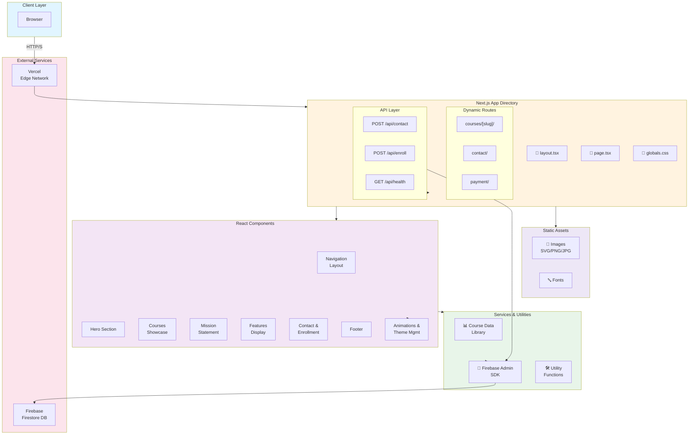

# 🎓 SkillNest

> A modern, scalable educational platform delivering comprehensive skill development through an intuitive, responsive web interface.


---

## 📖 Overview

SkillNest is a comprehensive educational platform that bridges the gap between learners and professional development. The platform offers a curated selection of courses spanning **spoken English training**, **personal development**, **academic tutoring**, and **emerging technologies** like AI.

Built with modern web technologies, SkillNest prioritizes **user experience**, **performance**, and **accessibility**, delivering a seamless learning journey across all devices.

> **Note:** This project concluded as a startup venture. The website remains deployed on Vercel for demonstration purposes.

---

## 🏗️ System Architecture



---

## 🚀 Tech Stack

| Layer | Technology | Purpose |
|-------|-----------|---------|
| **Framework** | Next.js 14+ | React meta-framework with SSR & static generation |
| **Language** | TypeScript 5.0+ | Type-safe development |
| **Styling** | Tailwind CSS | Utility-first CSS framework |
| **Components** | Radix UI | Accessible component primitives |
| **Icons** | Lucide React | Modern icon library |
| **Backend** | Firebase Admin SDK | Authentication & database |
| **Hosting** | Vercel | Optimized Next.js deployment |
| **PostCSS** | Autoprefixer | CSS vendor prefixing |

---

## 📦 Installation & Setup

### Prerequisites
- Node.js 18.17+ or later
- npm or yarn package manager
- Git

### Quick Start

```bash
# Clone the repository
git clone https://github.com/ari2387q/skillnest-website-build.git
cd skillnest-website-build

# Install dependencies
npm install

# Start development server
npm run dev
```

Visit `http://localhost:3000` to view the application.

---

## 🔧 Available Commands

| Command | Description |
|---------|-------------|
| `npm run dev` | Start development server with hot reload on port 3000 |
| `npm run build` | Create optimized production build |
| `npm start` | Run production server |
| `npm run lint` | Run ESLint for code quality checks |

---

## 🗺️ Application Routes

| Route | Component | Purpose |
|-------|-----------|---------|
| `/` | Home | Landing page with hero section & course overview |
| `/courses/[slug]` | Course Detail | Individual course page with curriculum & enrollment |
| `/contact` | Contact Form | User inquiry submission |
| `/payment` | Payment | Course payment processing |
| `/api/contact` | API Endpoint | POST - Submit contact form |
| `/api/enroll` | API Endpoint | POST - Enroll in course |
| `/api/health` | API Endpoint | GET - Service health check |

---

## 📚 Course Catalog

SkillNest offers nine core course categories:

- **Language & Communication**
  - Spoken English Training
  - Public Speaking & Personality Development

- **Professional Development**
  - Soft Skills & Motivation Training
  - IQ Development

- **Academic Services**
  - Class 4-10 Tutoring
  - SSC Competitive Exam Coaching
  - Playschool & Nursery Programs

- **Emerging Technologies**
  - Introduction to AI

- **Student Facilities**
  - Hostel & Transportation Services

---

## ✨ Core Features

### 🎯 User Experience
- **Responsive Design** - Optimized for mobile, tablet, and desktop
- **Dark Mode Support** - Theme switching with persistent preferences
- **Smooth Animations** - Scroll-triggered reveal effects and transitions

### ⚡ Performance
- **Server-Side Rendering** - Improved SEO and initial load times
- **Image Optimization** - Automatic Next.js image processing & lazy loading
- **Code Splitting** - Route-based code splitting for minimal bundle size
- **CSS Tree-Shaking** - Tailwind CSS purges unused styles

### 🛡️ Quality & Accessibility
- **Type-Safe Development** - Full TypeScript implementation
- **Semantic HTML** - Proper markup for screen readers
- **Accessible Components** - Radix UI primitives meet WCAG standards
- **ESLint** - Automated code quality enforcement

---

## 📊 Performance Metrics

- **Optimized Images** - Next.js automatic optimization & WebP support
- **Minimal JS Bundle** - Efficient component tree with lazy loading
- **CSS Optimization** - Tailwind CSS tree-shaking removes unused styles
- **CDN Delivery** - Vercel Edge Network for global distribution

### Browser Support

| Browser | Minimum Version |
|---------|-----------------|
| Chrome | Latest |
| Firefox | Latest |
| Safari | Latest |
| Edge | Latest |

---

## 📁 Project Structure

```
skillnest-website-build/
├── app/                          # Next.js App Router
│   ├── layout.tsx               # Root layout component
│   ├── page.tsx                 # Home page
│   ├── globals.css              # Global styles
│   ├── api/                     # API routes
│   │   ├── contact/route.ts
│   │   ├── enroll/route.ts
│   │   └── health/route.ts
│   ├── courses/
│   │   └── [slug]/              # Dynamic course pages
│   ├── contact/                 # Contact page
│   └── payment/                 # Payment page
├── components/                   # React components
│   ├── navigation.tsx
│   ├── hero.tsx
│   ├── mission.tsx
│   ├── features.tsx
│   ├── footer.tsx
│   ├── button.tsx
│   ├── scroll-reveal.tsx
│   └── theme-provider.tsx
├── lib/                         # Utilities & services
│   ├── course-data.ts
│   ├── firebaseAdmin.ts
│   └── utils.ts
├── public/                      # Static assets
│   ├── images/
│   └── icons/
├── package.json
├── tsconfig.json
├── tailwind.config.ts
└── README.md
```

---

## 🤝 Contributing

While this project is archived, insights and approaches may be valuable for similar educational platform projects.

---

## 📄 License

All rights reserved. © SkillNest Educational Platform

---

## 📞 Contact & Support

For questions regarding this project, please refer to the repository issues section.

---

**Built with ❤️ using Next.js, TypeScript, and Tailwind CSS**
